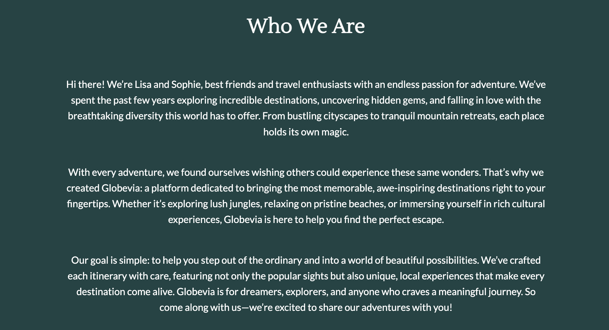

# Globevia

**Globevia** is a travel website that offers curated itineraries for breathtaking destinations, such as Bali, the Austrian Alps, and Mexico. The website is designed to inspire and help users plan their next adventure, targeting travelers looking for unique and memorable experiences. 

## Table of Contents
1. [Overview](#overview)
2. [Features](#features)
   - [Navigation](#navigation)
   - [Hero Section](#hero-section)
   - [Destinations Section (Home Page)](#destinations-section-home-page)
   - [Destinations Page](#destinations-page)
   - [About Us Page](#about-us-page)
   - [Sign-Up Form](#sign-up-form)
   - [Footer](#footer)
3. [Features Left to Implement](#features-left-to-implement)
4. [Testing](#testing)
   - [Validator Testing](#validator-testing)
   - [Browser Compatibility](#browser-compatibility)
   - [Device Responsiveness](#device-responsiveness)
5. [Bugs](#bugs)
6. [Deployment](#deployment)
7. [Credits](#credits)

## Overview
Globevia offers visitors a gateway to thrilling travel experiences through curated itineraries and visually engaging sections that make planning easy and exciting. This website is geared toward those looking for adventure in diverse destinations with a balance of relaxation and exploration.

### Responsiveness Screenshot

---

## Features

### Navigation
- Located at the top of the page, the navigation bar allows users to quickly access the Home, Destinations, About Us, and Sign-Up pages.
- The navigation includes a responsive design, with a hamburger menu for mobile devices.

### Hero Section
- The hero section displays an engaging message and a background image that represents the spirit of adventure. It encourages users to explore the Destinations page.

### Destinations Section (Home Page)
- The Home page includes a Destinations section that briefly introduces the three main destinations—Bali, Mexico, and the Austrian Alps.
- Each destination includes an image, a brief description, and a button to view more details on the Destinations page.

### Destinations Page
- The Destinations page provides detailed itineraries for each of the featured locations (Bali, Mexico, and the Austrian Alps).
- Each itinerary outlines a day-by-day guide, including activities and highlights specific to that location.

### About Us Page
- The About Us page introduces the founders, Lisa and Sophie, who share their passion for travel and the inspiration behind Globevia.
- A YouTube video is embedded to give users a visual experience of the adventures Globevia offers.

### Sign-Up Form
- A user-friendly sign-up form collects visitor information (name, age, and email) and includes validation for required fields.
- The form submission directs users to a thank-you page, welcoming them as travelers.

### Thank You Page
- After submitting the sign-up form, users are directed to a Thank You page that confirms their registration and provides a button to return to the Home page.

### Footer
- The footer provides links to Globevia’s social media pages (Facebook, Instagram, and YouTube), allowing users to connect with the brand.
- Each icon opens in a new tab, ensuring users can easily explore without leaving the website.

---

## Features Left to Implement
- **FAQ Page:** An FAQ page to address common questions about travel itineraries and planning.
- **404 Page:** A custom 404 page to inform users if they navigate to a non-existent page.
- **Thank You Page Customization:** Enhance the thank-you page to display personalized greetings.

---

## Testing

### Validator Testing
- #### HTML
    - No errors were returned when passing through the official W3C Markup Validator.
        - [W3C Validator Results](https://validator.w3.org/nu/?doc=https%3A%2F%2Flisareitinger.github.io%2FGlobevia%2Findex.html)

- #### CSS
    - No errors were found when passing through the official W3C CSS Validator.
        - [W3C CSS Validator Results](https://jigsaw.w3.org/css-validator/validator?uri=https%3A%2F%2Flisareitinger.github.io%2FGlobevia%2F&profile=css3svg&usermedium=all&warning=1&vextwarning=&lang=sv)

### Accessibility
- Lighthouse was used to check accessibility, achieving a high score. The website ensures color contrast and font readability.

### Browser Compatibility
The website was tested in the following browsers:
- **Google Chrome**
- **Mozilla Firefox**
- **Microsoft Edge**

### Device Responsiveness
The website was tested on various devices to ensure a responsive layout across screen sizes:
- **Desktop**
- **Tablet**
- **Mobile (iPhone and Android)**

Testing sites used:
- [Responsinator](https://www.responsinator.com)
- [Am I Responsive](http://ami.responsivedesign.is)

---

## Bugs

### Fixed Bugs
- **Favicon Issue:** Fixed an issue where the favicon was not displaying properly on GitHub Pages by adjusting file paths.
- **Navbar Positioning:** Resolved an issue with the navigation bar overlapping content on mobile view by adjusting the CSS for mobile screens.

### Known Bugs
- **Button Class Issue:** The button class has an absolute position, which causes positioning conflicts when used outside the main index page. A separate class was created as a temporary fix.

---

## Deployment
The project was deployed using GitHub Pages. Follow these steps for deployment:
1. In the GitHub repository, navigate to **Settings**.
2. Under **Pages**, select the **main branch** as the source.
3. Save changes, and GitHub will provide the live link for the site.

**Live Link:** [Globevia on GitHub Pages](https://lisareitinger.github.io/Globevia/index.html)

---

## Credits

### Content
- **Home Page Text:** The introductory text was crafted to engage users, highlighting travel opportunities in Bali, Mexico, and the Austrian Alps.
- **Sign-Up Form Validation:** Form validation techniques were inspired by tutorials on W3Schools.

### Media
- **Images:** Destination images were sourced from [Pexels](https://www.pexels.com) and [Pixabay](https://pixabay.com).
- **Icons:** Social media icons in the footer were provided by Font Awesome.
- **YouTube Video**: Embedded video to visually represent travel destinations and experiences.
    - [YouTube Video Link](https://www.youtube.com/watch?v=R-07lW6jsDw)
- **Image Optimization**: Images were optimized for web performance using TinyJPG.
    - [TinyJPG](https://tinyjpg.com/)
  
**Acknowledgments:** Special thanks to my mentor, project reviewers, and friends who tested the website and provided valuable feedback.
